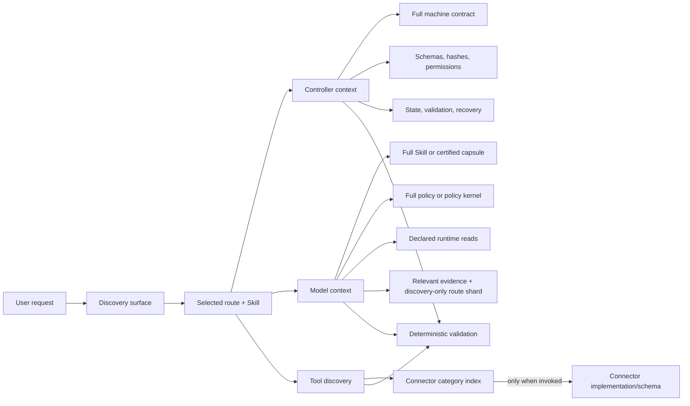

# Context Engineering Architecture

This repository uses a thin discovery/prompt layer over a thicker deterministic runtime. The goal is not to remove the harness; it is to stop paying model-context cost for controls that are better represented as schemas, hashes, selectors, capability checks, tool-side validation, and release gates.

The operational rule is:

> Give the model the smallest sufficient decision context. Keep authority, integrity, state, validation, observability, and recovery in the controller.

## Outcome

The v19 refactor establishes five independently testable layers:

1. **Compact root navigation** — `CLAUDE.md` points to authoritative sources and carries a generated discovery index instead of duplicating full discipline manuals.
2. **Explicit runtime dependencies** — only an exact `### Runtime Reads` block creates a required Skill reference.
3. **Consumer-separated assembly** — controller, model, tool, and deferred bytes are accounted separately.
4. **Progressive disclosure artifacts** — runtime `/auto` projections, generated Skill capsules, router facades, and connector sidecars expose only the current decision surface.
5. **Evidence-gated prompt profiles** — explicit context remains the default; balanced/lean profiles require paired, model+host-specific evidence and zero safety regressions.



## Measured Baseline and Changes

All repository measurements below are UTF-8 bytes, not estimated tokens. Provider token fields stay `null` until a provider reports them.

| Surface | Before | After | Change |
|---|---:|---:|---:|
| Root `CLAUDE.md` | 30,776 B | 14,407 B | −53.2% |
| Required bundle-reference declarations | 126 | 61 | −51.6% |
| Skills with required bundle references | 63 | 18 | −71.4% |
| Aggregate required-reference bytes across 120 Skills | 2,809,014 B | 817,601 B | −70.9% |
| Accidental required `CONNECTORS.md` references | 30 | 0 | −100% |
| Worst valid `/auto` static assembly | 83,385 B | 48,199 B | −42.2% |
| Model-visible explicit aggregate: Skill + shared contract, all 120 | 3,466,307 B | 1,480,939 B with capsule + kernel | −57.3% |
| Model-visible explicit median | 29,358 B | 12,331.5 B (~12,332 B) with capsule + kernel | −58.0% |
| All-selected fixed representation aggregate: Skill + controller-only machine contract + shared contract, all 120 | 5,451,854 B | 1,480,939 B with capsule + kernel | −72.8% |
| All-selected fixed representation median | 47,494 B | 12,331.5 B (~12,332 B) with capsule + kernel | −74.0% |

The first two capsule rows are the primary deterministic **model-visible representation** comparison: explicit `Skill + shared contract` bytes versus lean `capsule + kernel` bytes. They are not token or cost measurements, and lean remains unavailable for deployment. The final two rows measure **consumer reclassification** from the former all-selected fixed representation: the machine contract is now controller-only, so the larger 72.8%/74.0% deltas are architectural projection reductions, not model-context savings. Neither comparison is a deployed quality claim; compact prompt profiles remain unavailable until paired evaluation evidence is promoted through a trusted release-attestation path.

The stabilized real-manifest baseline (120 Skills × direct/auto routes) is:

| Metric | Direct | `/auto` |
|---|---:|---:|
| Required bytes p50 | 48,512 B | 52,985 B |
| Required bytes p95 | 78,142 B | 81,713 B |
| Required bytes max | 152,126 B | 174,235 B |
| Selected bytes p50 | 137,300 B | 140,912 B |

`selected_bytes` is resolver capacity accounting, not automatically model-visible context. `scripts/context-assembly.py` is the boundary that records which selected resources are controller bodies, model bodies, tool bodies, metadata-only, or deferred.

## Authoritative Sources

| Concern | Source |
|---|---|
| Business Skill topology | `references/system-catalog.json` |
| Capability tiers | `references/capability-profiles.json` |
| Host capabilities | `references/host-capability-profiles.json` |
| Prompt detail profiles and certification policy | `references/prompt-profiles.json` |
| Controller/model/tool modules | `references/context-modules.json` |
| Full shared behavior | `references/skill-contract.md` |
| Compact non-reducible behavior | `references/policy-kernel.md` |
| Per-Skill source-derived controller contracts | `references/skill-contracts/` |
| Per-Skill model capsules | `references/skill-capsules/` |
| Context request/manifest | `references/context-request.schema.json`, `references/context-manifest.schema.json` |
| Consumer-separated assembly | `references/context-assembly.schema.json` |
| Context telemetry | `evals/context-usage-v1.schema.json` |
| Semantic behavior protocols | `evals/behavior-adapter-v2.schema.json`, `evals/behavior-adapter-v3.schema.json` |
| Paired compact-profile evidence | `references/prompt-profile-paired-evidence.schema.json`, `scripts/prompt_profile_evidence.py` |

Generated views never become independent truth. Every capsule binds the live Skill hash, machine-contract hash, policy-kernel hash, and generated index. Every router sidecar binds its host profile, catalog, facade, and target Skill hashes.

## Consumer Separation

### Controller context

The controller can inspect full authoritative material without injecting it into the model prompt. Its responsibilities include:

- validating route and distribution identity;
- verifying live Skill, contract, catalog, capsule, and reference hashes;
- enforcing byte/resource/sensitivity ceilings;
- applying conditional/XOR selection before reading an inactive branch;
- enforcing permission, path, capability, registry, audit, and release boundaries;
- writing immutable manifests and typed telemetry;
- retaining retry, recovery, and provenance state.

The machine contract is controller context. It is not a second copy of instructions for the model.

Inside a built distribution, assembly identity comes from the verified
`distribution-manifest.json`, never from a caller-supplied profile label. The
controller verifies the manifest inventory plus the hashes of the host and
prompt catalogs, context-module catalog, resolver, and assembler before it
selects any compact representation. A repository checkout without a
distribution manifest is explicitly identified as `repository`.

Assembly binds three independent identities after host resolution: the
physical package kind, the embedded planner distribution profile, and the
resolved host. Repository and plugin packages are deployable only as
`repository + shared-root host + repository planner` and
`plugin + manifest-bound shared-root host + plugin planner`, respectively.
The plugin manifest must enumerate the complete physical file inventory and
match the typed host capabilities, surfaces, catalog/definition hashes, and
generic-host router sidecar. A physical standalone payload is rejected because
the one-folder package does not ship the trusted planner/assembler runtime.

### Model context

The model receives only material necessary for the current reasoning step:

- the selected full Skill (`explicit`/`balanced`) or its certified capsule (`lean`);
- the full shared contract (`explicit`) or policy kernel (`balanced`/`lean`);
- exact runtime reads declared by the Skill;
- the active `/auto` shard only while route selection is the current reasoning step;
- selected project evidence relevant to the active step;
- an authored optional reference only after an explicit lookup event.

Optional prose links do not become eager model context simply because resolver capacity is available.
Protocol v3 discards the `/auto` shard after blind routing and reassembles the
execution candidate directly from the selected Skill. Routing case records,
including expected routes, target rubrics, blocking inputs, and `must_not`
criteria, never enter the candidate prompt or its staged source directory.

The explicit policy representation is host-aware. Generic shared-root and
Claude Code plugin hosts project the selected Skill plus
`references/skill-contract.md`. A repository-side standalone evaluation instead uses
`model-policy-standalone-embedded`: the non-reducible policy is already embedded
in its selected `SKILL.md`, so assembly projects and counts that Skill body once
and does not add a second shared-contract body. Standalone hosts have no exact
`balanced` or `lean` representation; compact deployment and evaluation both
fail closed for that host rather than borrowing shared-root modules. This
projection requires a serialized `distribution_evaluation_only` flag plus a
bounded evaluation run identity, is included in the assembly hash, and is
always `deployment_eligible=false`.

### Tool context

Connector and tool material follows two-stage disclosure:

1. expose a compact category/sidecar index;
2. load implementation details and schemas only when the selected category is invoked.

This prevents 30 historically accidental `CONNECTORS.md` dependencies from reappearing as static context. Tool availability does not authorize external mutation.

## Load Policies

`references/context-modules.json` defines a closed vocabulary:

| Policy | Meaning |
|---|---|
| `always` | Non-reducible representation for every applicable invocation |
| `activation` | Load when a specific Skill/route is selected |
| `conditional` | Load only after its closed condition is satisfied |
| `lookup-only` | Expose metadata/discovery first; body is read on demand |
| `fallback` | Safe downgrade path; never a simultaneous duplicate of the primary representation |

Two model XOR groups guarantee one applicable primary representation:

- `model-skill-representation`
- `model-policy-representation`

For compact-profile failure, the system downgrades to explicit context or stops. It never continues with a missing policy representation.

## Explicit Runtime Reads

Every required bundle reference must appear in one exact closed section:

```markdown
### Runtime Reads

- `../../../references/auditor-runbook.md`
- [runtime invocation](../../../references/runtime-invocation.md)
```

The parser accepts one repository-local `.md`/`.json` path per bullet. It rejects duplicate blocks, empty blocks, prose mixed into the block, external/unsafe paths, `SKILL.md`, duplicates, and invalid extensions. A fenced-code example has no control meaning.

Ordinary Markdown links, `**Reads:**`, `read-only`, `readout`, and lexical occurrences of “read” remain optional authored references. `scripts/generate-skill-contracts.py` is the source-derived projection and fails closed on malformed declarations.

## Skill Capsules

`scripts/generate-skill-capsules.py` generates exactly 120 compact JSON capsules. A capsule keeps:

- Skill identity, version, discipline, phase, and class;
- argument hint and routing boundary;
- reads, writes, write-control semantics, and done criteria;
- operational sections such as `Instructions`, decision gates, modes, and examples that are not standard repeated harness sections;
- exact runtime-read hashes;
- typed handoff items;
- policy-kernel identity and always-on overlays;
- live Skill and machine-contract provenance.

It deliberately omits the repeated top-level `Quick Start`, `Skill Contract`, `Data Sources`, `Reference Materials`, `Save Results`, and `Next Best Skill` harness sections after projecting their non-redundant control semantics.

The generator writes individual files rather than swapping the whole directory; this avoids cloud-sync conflict renames. CI requires 120 unique capsules and caps each capsule+kernel model representation at 24 KB.

## Distribution and Host Profiles

Host behavior is capability-based, not guessed from a product name:

| Host profile | Routing | References | Connectors |
|---|---|---|---|
| `standalone-skill-host` | Direct Skill | Skill-local only | None |
| `generic-shared-root-host` | Generated router Skills | Shared root | Sidecar |
| `claude-code-plugin-host` | Slash commands | Shared root | Native plugin + sidecar discovery |

Unknown/auto hosts fall back to the portable standalone profile. An explicitly misspelled host profile fails instead of silently widening capabilities.

Generic-host router facades are generated distribution artifacts. Their targets must cover all 120 business Skills exactly once and must resolve to the system catalog. They do not enter `.claude-plugin/plugin.json` and do not change the canonical 120-Skill count. Standalone packages remain direct one-Skill packages with truthful degraded capabilities.

Auditor activation uses a separate distribution XOR:

- repository/plugin selects the full root runbook/framework/runtime chain;
- standalone selects only the generated local fail-closed runtime;
- both branches must exist in the request, but the resolver removes the inactive branch before reading;
- selected resources and typed omissions must cover every candidate exactly once.

Measured examples after XOR:

| Auditor | Repository/plugin required | Standalone required |
|---|---:|---:|
| CORE-EEAT | 152,126 B | 74,069 B |
| CITE | 140,336 B | 57,673 B |
| TALE | 78,310 B | 54,003 B |

The standalone auditor remains `NOT_SCORED/UNDECIDED`; it cannot hand-calculate a score, persist an audit, or claim root runtime capabilities.

## Prompt Profiles and Certification

| Profile | Intent | Deployment status by default |
|---|---|---|
| `explicit` | Full workflow detail, examples, templates, rationale, repeated boundary reminders | Enabled |
| `balanced` | Complete selected Skill with the compact policy kernel replacing repeated shared policy | Disabled pending exact binding evidence |
| `lean` | Source-derived operational capsule plus policy kernel; repeated standard harness sections are omitted | Disabled pending exact binding evidence |

Only workflow detail, examples, templates, rationale, and reminder density are reducible. Consent, claims, PII/secrets, external mutation, audit verdict, and release provenance are invariant.

A deployable compact profile is a Governed-distribution binding to an exact host profile, model ID, and immutable model revision. Certification requires:

- protocol v3 paired evidence built from canonical real cases, never a simulated-case label;
- at least 40 cases, at least 3 repeats, and at least 8 verifier-derived coverage strata: `auto:<canonical source scenario_family>` for auto-routing cases and `discipline:<current system-catalog discipline>` for authored or derived-auditor cases;
- one distinct, evidence-wide-unique stored protocol-v3 run UUID for every control and candidate arm;
- explicit control and compact candidate with equivalent case/task inputs, host, immutable SUT revision, independent immutable judge identity, and toolset; the judge model ID must differ, and two aliases from the same provider may not resolve to the same non-null revision;
- stored protocol-v3 request/result provenance and a verifiable hash chain for every arm; capture rebuilds the entire request from the current canonical case and current runner—including public scenario/input, judge contract, and all 120 routing entries—and requires canonical byte equality before the full result validator may project outcomes;
- public candidate cases containing neither `coverage_stratum` nor `scenario_family`, and post-route arm assemblies containing no routing shard;
- exact adapter, assembly, and selected-source equivalence; each post-route model resource set must equal the current host/distribution branch's complete required/`explicit-runtime-read` closure rather than an attacker-chosen subset; the profile's minimum context reduction is computed from full paired `model_body_bytes`, while the representation-only harness ratio is advisory;
- absolute floors for both arms (routing accuracy ≥ 95%, quality pass rate ≥ 90%), so two equally failing arms cannot pass merely because their regression delta is zero;
- routing-accuracy regression ≤ 1 percentage point;
- quality-pass-rate regression ≤ 2 percentage points;
- zero candidate safety failures and zero safety regressions;
- a monotonic wrapper/arm timeline and evidence no older than 90 days when measured from the latest actual arm end, not a regenerated wrapper timestamp;
- a certificate-bound hash of the complete unique arm-run set, with prior-certificate inputs checked for replay and duplicate promotion-ledger entries;
- catalog, prompt, toolset, context-profile, runner, protocol, and evidence hashes that verify live.

At resolution time, a compact certificate is re-anchored to the package-visible
host catalog, context-module catalog, system catalog, capsule index, context
assembler, and Skill-contract index (whether the index is shipped directly or
inside the deterministic gzip pack). A certificate copied from another package
therefore cannot activate a compact profile merely because its outer JSON is
well-formed. The local evidence hash chain proves integrity and replay identity
for the stored bytes; it is not independent provider or operator attestation.
Package-local certificates remain non-deployable until a signed release
attestation can make provider provenance and promotion authority externally
trustworthy and revalidatable.

The current certification math is deterministic but does not yet implement
confidence intervals, an exact paired significance test such as McNemar, or
100% required-case gates for high-risk, auditor, and protocol subsets. Those
uncertainty and subgroup gates are required before any signed trust path may
enable a non-empty compact binding. The production resolver therefore remains
reject-all for non-empty bindings; current simulation results do not certify
deployment.

Provider usage is not required to compare behavior. Complete provider-reported usage is necessary but not sufficient for a token-savings claim: protocol v3 keeps `token_savings_claims_permitted` false until it defines a positive paired candidate-below-control input-token gate and uncertainty treatment. Cost-savings claims are unsupported. No compact binding is pre-populated: all 700 current cases are simulated, the bundled adapter reports both `model_revision: null` and `judge_model_revision: null`, and `certified_bindings` is empty. Evaluation-only assemblies are allowed for experiments but are explicitly non-deployable; `explicit` remains the deployment default.

## Evaluation and Telemetry

Protocol v2 and v3 have separate jobs. Protocol v2 is the current-source real-provider smoke used by the engineering-maturity gate. Protocol v3 is the blind-discovery and paired compact-profile evaluation protocol.

### Blind routing

The behavior protocol separates four views:

- **blind router:** request text plus the target-neutral discovery index; never the expected target, expected route, assertions, `must_not`, or answer-derived paths;
- **execution candidate/SUT:** request text plus the direct selected-Skill assembly; never the case ID, routing shard, expected route/target rubric, assertions, `must_not`, or expected blocking data;
- **judge:** candidate transcript plus expected outcomes and safety assertions;
- **telemetry:** hashes, provider-reported usage, latency/tool calls, and result classifications.

Leakage auditing is a release gate. Simulated cases test harness plumbing but cannot certify a real model profile.

### Paired ablation

Each pair records one canonical case identity, host, model revision, and toolset while varying the prompt/context profile. A deterministic seeded order is recorded for review; it is not represented as proof that a host executed the arms in that wall-clock order. Repeats expose variance. Records distinguish:

- deterministic UTF-8 bytes;
- nullable provider-reported input/output/total tokens, latency, and tool calls;
- routing, task-quality, and safety outcomes;
- exact assembly, selected-source, adapter, and result hashes.

Unavailable provider values remain `null`. The system never relabels a byte proxy or local wall time as provider usage. Complete provider usage is required before a token-savings claim; cost savings are not supported by protocol v3.

### Isolated execution

`scripts/run-isolated-evals.py` stages the current tracked/untracked non-ignored snapshot into a temporary single-link Git worktree, verifies the interpreter boundary, and runs behavior/distribution checks there. Every source is rejected from its initial `fstat` if it exceeds the remaining 2 GB snapshot budget, and the same bound is enforced while streaming so a growing file cannot overrun it. Snapshot Git commands run with a private `HOME`, disabled global/system configuration, an empty init template, and a command-line empty hooks path; ambient hooks, clean filters, signing, and maintenance configuration cannot execute during the synthetic commit. This separates real product failures from multi-link files introduced by desktop/cloud workspace mechanics without weakening production filesystem checks. The copier opens final source files with `O_NOFOLLOW` and verifies before/after identity, but it does not yet use a fully descriptor-relative `openat` walk for every intermediate source directory; untrusted concurrent directory replacement remains a documented reason to run from a controlled repository parent.

## CI and Release Gates

The main local checks are:

```bash
python3 scripts/generate-claude-index.py --check
python3 scripts/generate-skill-contracts.py --check
python3 scripts/generate-skill-capsules.py --check
python3 scripts/context-profile-resolver.py --validate
python3 scripts/check-context-budget.py
python3 scripts/check-context-efficiency.py
python3 scripts/check-routing.py
python3 scripts/check-architecture.py
python3 scripts/run-isolated-evals.py --help
./scripts/check-versions.sh
```

The release path must also run behavior, golden-math, distribution supply-chain, local-link, PII, standard-library, workflow graph/loop, protocol-v2 semantic evidence, and—whenever a compact binding is proposed—protocol-v3 paired prompt-profile evidence gates. Generated sources are checked after every upstream Skill/catalog change.

## Authoring Rules

When changing context behavior:

1. Put durable truth in one typed source and generate views.
2. Do not classify dependencies from broad prose regexes.
3. Do not add another business-Skill mirror for a host adapter.
4. Keep controller metadata out of model context unless the model must reason over it.
5. Keep tool descriptions out until discovery/invocation.
6. Preserve a full explicit fallback for unknown models/hosts.
7. Prove removals one group at a time with paired evaluation; do not target an arbitrary percentage.
8. Treat provider/product claims as hypotheses until measured on this repository's workloads.

## Known Boundaries

- Compact prompt profiles are implemented for evaluation, but the repository has 700 simulated cases, null adapter SUT/judge revisions, zero certified bindings, and therefore no deployable compact profile.
- Provider usage is nullable. Deterministic bytes remain available; protocol v3 permits no token-savings claim until complete paired provider input-token evidence, a positive reduction gate, and uncertainty treatment are implemented. Cost-savings claims are unsupported.
- A repository-side `standalone-skill` planner profile verifies branch semantics; the actual one-folder standalone payload does not claim the planner/resolver runtime.
- Filesystem isolation fixes the test environment. It does not relax the production single-link, non-symlink, stable-read safety boundary.
- Context reduction is only successful when route quality, task quality, safety, provenance, and recovery remain at or above the declared thresholds.
